<p align="center">
  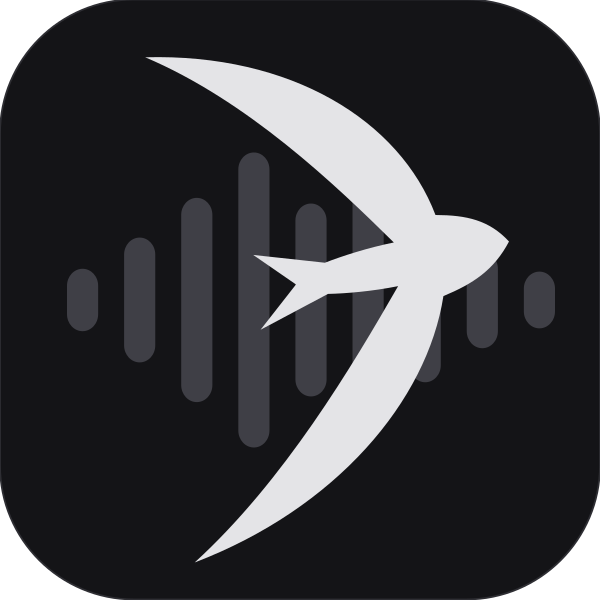
</p>

# SwiftFlac


Minimalist local FLAC music player for iOS, iPadOS, and macOS. Built with `SwiftUI` and first-party Apple frameworks. 

Folders are playlists: point it at a music folder and each subfolder becomes a playlist, with album, artist, and all-track views built from the files' own tags and embedded cover art.

## Screenshots

### macOS

| Light | Dark |
|---|---|
| 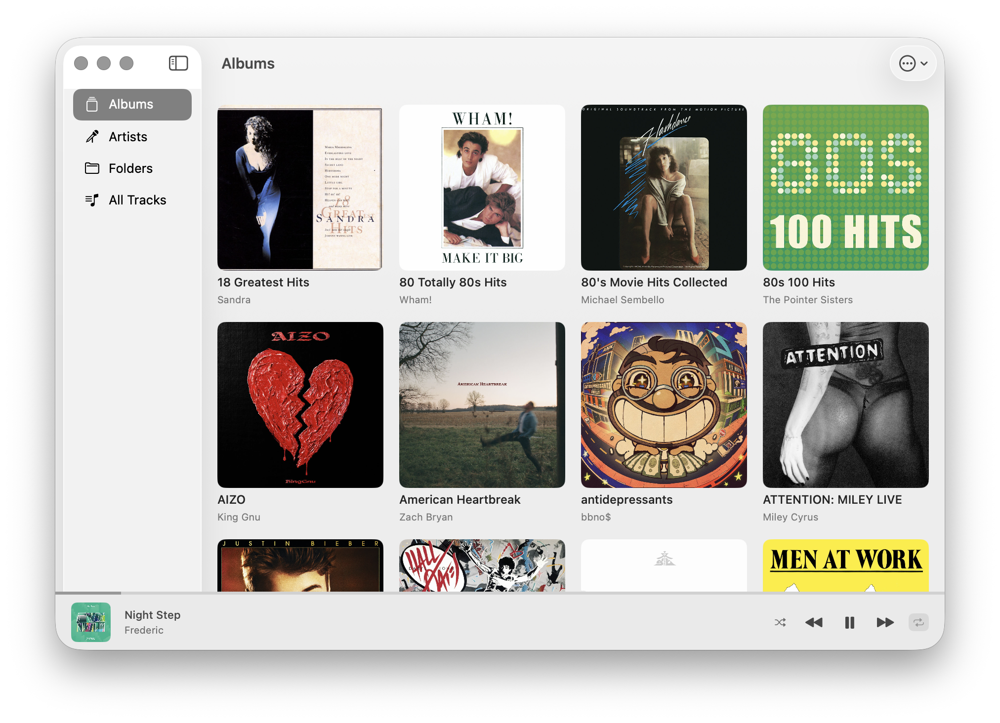 | 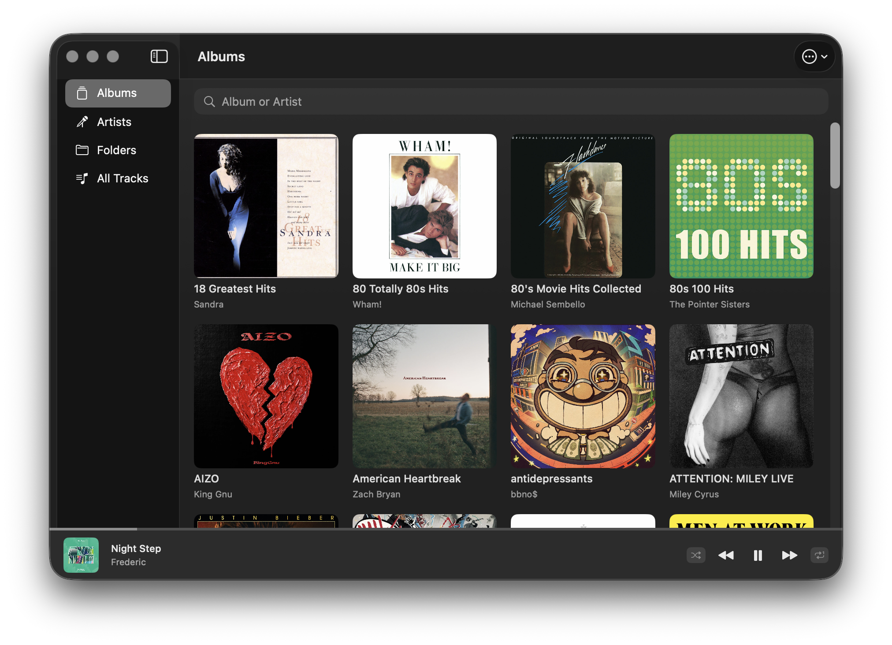 |
| 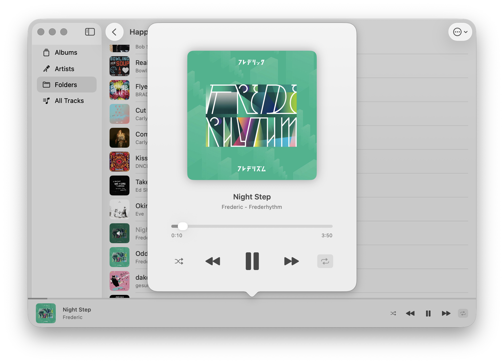 | 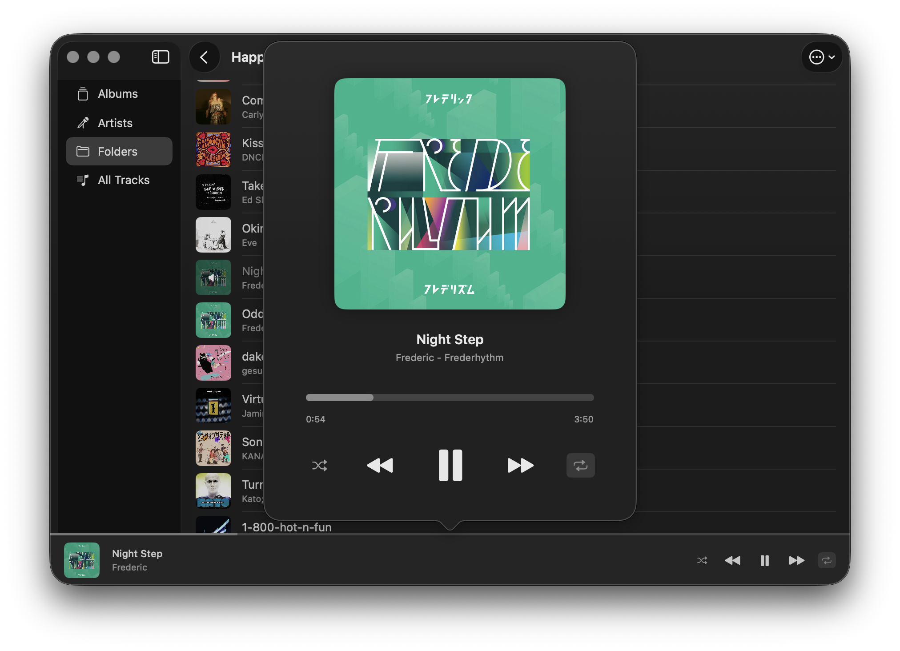 |

### iOS

| | | | |
|---|---|---|---|
| 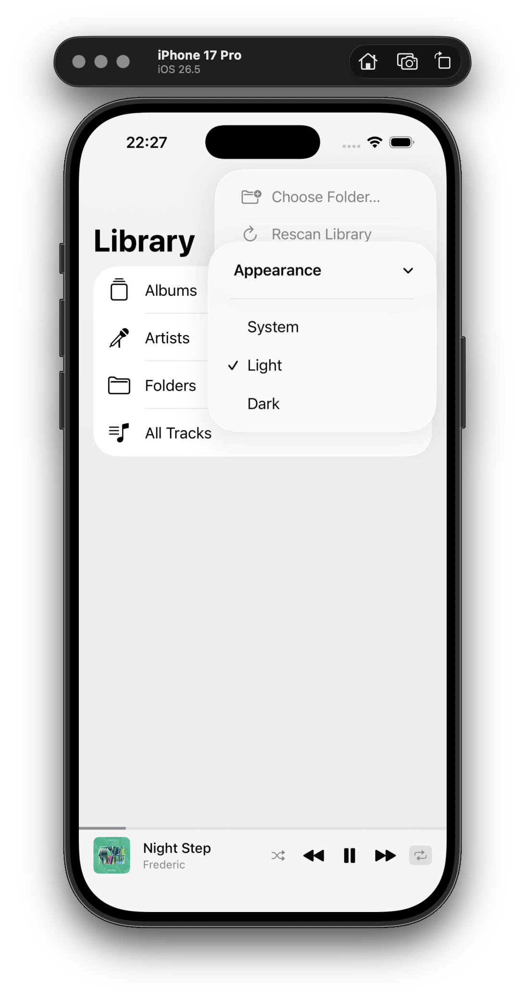 | 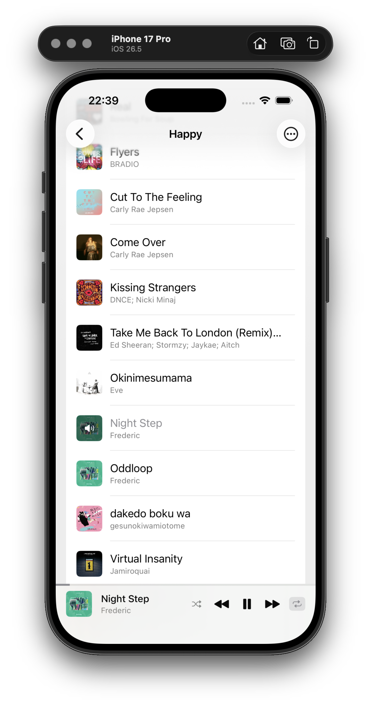 | 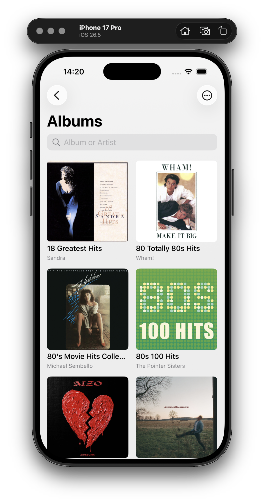 | 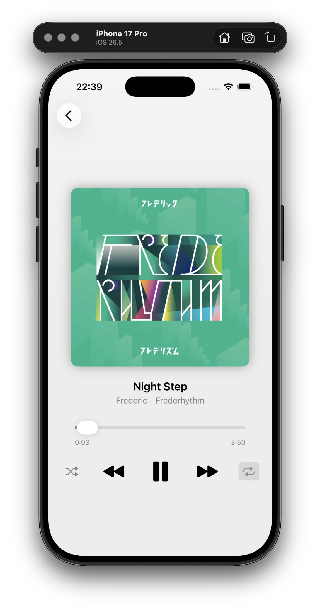 |
| 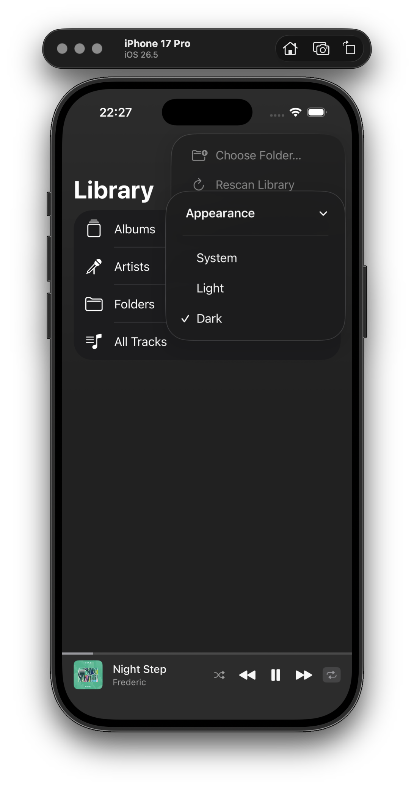 | 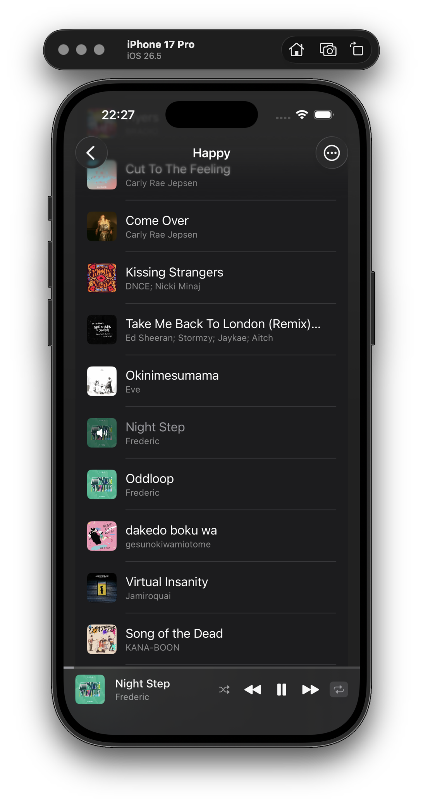 | 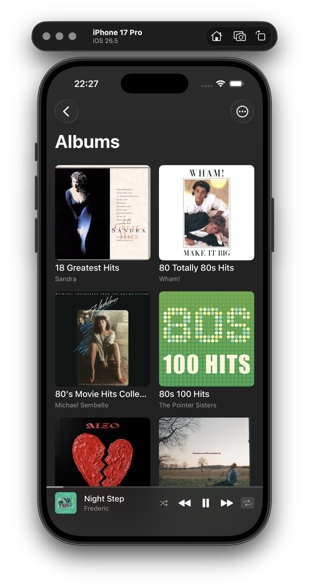 | 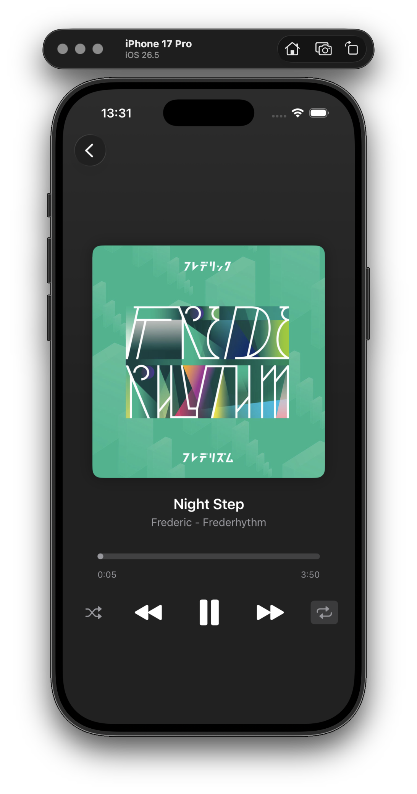 |

## Building

Requires Xcode 26 on macOS.

```sh
./build_and_run_mac.sh   # build and launch the macOS app
./build_and_run_ios.sh   # build, install, and launch in an iPhone simulator
```

The iOS script seeds a `Music/` folder at the repo root (gitignored) into the simulator app's Documents, so drop music there - subfolders become playlists - to have a library ready on first launch. On a real device, add music through Finder/Files file sharing or the in-app folder picker.

The app icon source is `swiftflac-icon.svg`; run `./generate_icon.sh` after editing it to regenerate the asset catalog images.

### Known limitation

The macOS 26 Dock shows a generic placeholder icon for apps launched from build directories, including the one `build_and_run_mac.sh` produces. The real icon appears when the app runs from `/Applications` or `~/Applications`; nothing else is affected.

## License

MIT - see [LICENSE](LICENSE).
