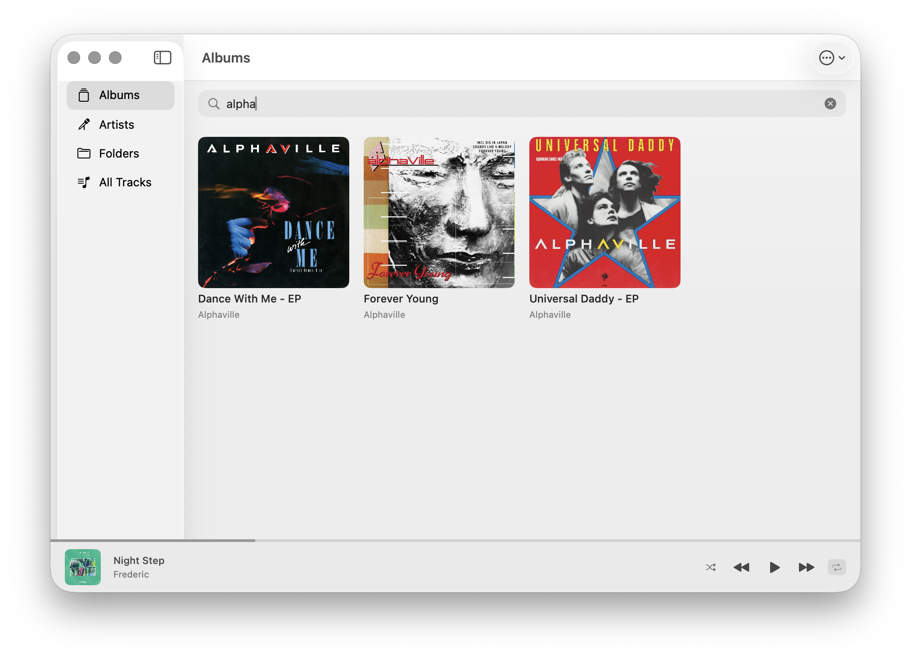
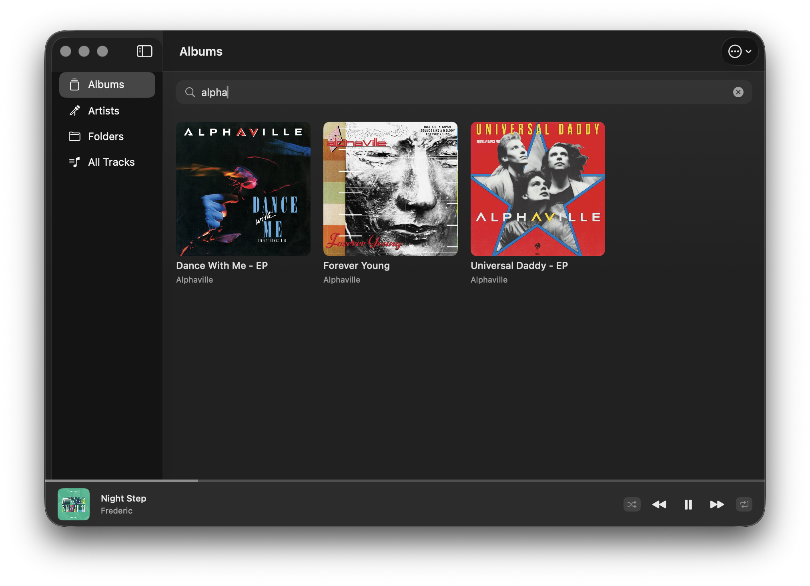
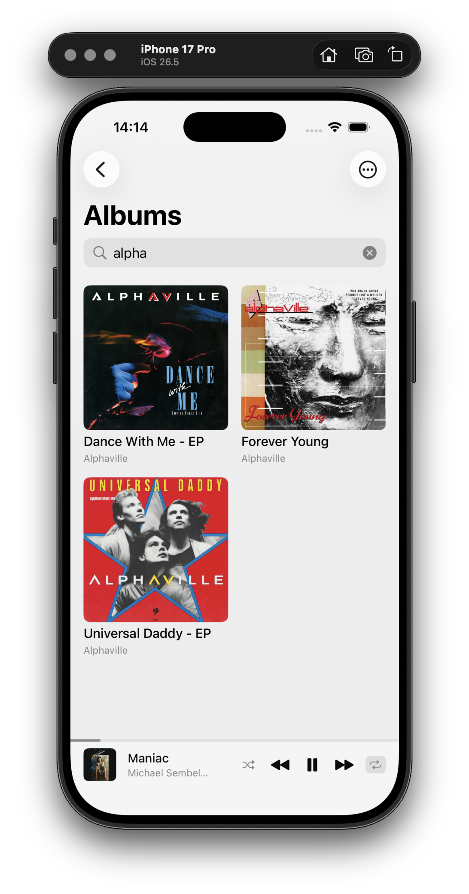
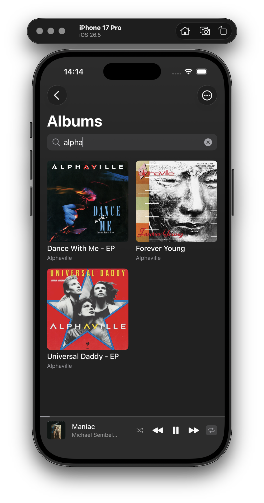

<p align="center">
  
</p>

# SwiftFlac


> ⚠️ very much a work in progress

Minimalist local music player for iOS, iPadOS, and macOS. Built with `SwiftUI` and first-party Apple frameworks. Plays FLAC, MP3, M4A/AAC, ALAC, WAV, and AIFF.

> FLAC remains the primary supported format

WAV and AIFF files typically carry no embedded tags or cover art, so they show up with filename-based titles and a placeholder cover.


Folders are playlists: point it at a music folder and each subfolder becomes a playlist, with album, artist, and all-track views built from the files' own tags and embedded cover art.

## Screenshots

### macOS

| Light | Dark |
|---|---|
|  |  |
|  |  |
|  |  |

### iOS

| | | | | |
|---|---|---|---|---|
|  |  |  |  |  |
|  |  |  |  |  |

## Building

Requires Xcode 26 on macOS.

```sh
./build_and_run_mac.sh   # build and launch the macOS app
./build_and_run_ios.sh   # build, install, and launch in an iPhone simulator
```

The iOS script seeds a `Music/` folder at the repo root (gitignored) into the simulator app's Documents, so drop music there - subfolders become playlists - to have a library ready on first launch. On a real device, add music through Finder/Files file sharing or the in-app folder picker.

The app icon source is `swiftflac-icon.svg`; run `./generate_icon.sh` after editing it to regenerate the asset catalog images.

### Known limitation

The macOS 26 Dock shows a generic placeholder icon for apps launched from build directories, including the one `build_and_run_mac.sh` produces. The real icon appears when the app runs from `/Applications` or `~/Applications`; nothing else is affected.

### Running on an iPhone

A free Apple ID is enough, no paid developer account needed:

1. Xcode → Settings → Accounts → add your Apple ID (creates a free Personal Team).
2. On the iPhone: Settings → Privacy & Security → Developer Mode → on (restarts the phone). Connect it by cable once and tap Trust.
3. Open the project in Xcode, target → Signing & Capabilities → tick "Automatically manage signing" and pick your team.
4. Select the iPhone as run destination and hit Run. On first launch, trust the certificate on the phone under Settings → General → VPN & Device Management.

Free-account builds expire after 7 days; hit Run again to re-sign. Add music via Finder file sharing (iPhone → Files → SwiftFlac) and rescan from the ⋯ menu.

## License

MIT - see [LICENSE](LICENSE).
